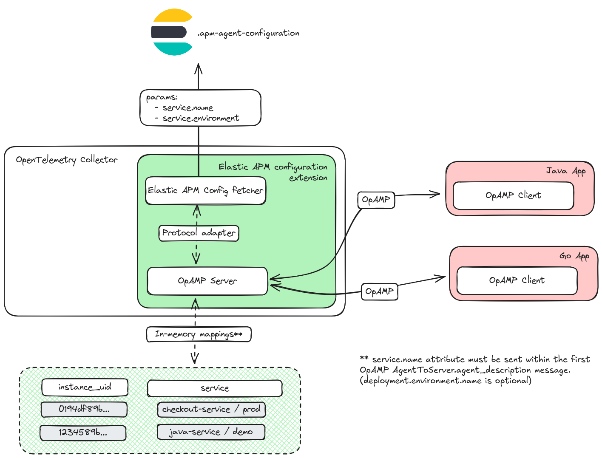

# Elastic APM Central configuration extension

This extension provides a mechanism for OpAMP based agents to retrieve its
remote configuration set via the [APM Central
Configuration](https://www.elastic.co/guide/en/observability/current/apm-agent-configuration.html).

An OpAMP server will be started with a local endpoint where the OpAMP agents can
connect into. The extension will reply with an [OpAMP ServerToAgent
message](https://github.com/open-telemetry/opamp-spec/blob/main/specification.md#servertoagent-message)
with the corresponding remote configuration fields.

Central configuration was build for Elastic's APM agents which are identified by
the
[service.name](https://www.elastic.co/guide/en/ecs/1.12/ecs-service.html#field-service-name)
and
[service.environment](https://www.elastic.co/guide/en/ecs/1.12/ecs-service.html#field-service-environment)
(optional) attributes. These attributes **must** be set on the
[AgentDescription.identifying_attributes](https://github.com/open-telemetry/opamp-spec/blob/main/specification.md#agentdescriptionidentifying_attributes)
field during the first send
[AgentToServer](https://github.com/open-telemetry/opamp-spec/blob/main/specification.md#agenttoserver-message)
message. As the `AgentDescription` should not be send if not changed, the
extension will maintain an internal mapping between the `agent.instance_id` and
its service identifing attributes.

The [ServerToAgent.ReportFullState
flag](https://github.com/open-telemetry/opamp-spec/blob/main/specification.md#servertoagentflags)
will be set in the following cases:

- The agent did not include the `service.name` identifing attributes during the
first message.
- The OpAMP server was not able to identify the agent (undefined
`agent.instance_id`).

The agent **must** return a message with the corresponding
`AgentDescription.identifying_attributes`.

## OpAMP Remote Config

The OpAMP protocol defines a
[AgentRemoteConfig](https://github.com/open-telemetry/opamp-spec/blob/v0.11.0/proto/opamp.proto#L913)
structure within the
[ServerToAgent](https://github.com/open-telemetry/opamp-spec/blob/v0.11.0/proto/opamp.proto#L187)
to share a configuration that should be applied by the connected agent.

- The `AgentRemoteConfig` structure contains a map of configurations, where each
key represents a file name or subsection. This extension assumes that connected
agents use only a single configuration file or section, meaning the map will
contain only one entry—and in this case, the key may be an empty string.
- Since the configuration is encoded in JSON, the
[content_type](https://github.com/open-telemetry/opamp-spec/blob/v0.11.0/proto/opamp.proto#L948C12-L948C24)
field in the `AgentRemoteConfig` is set to `text/json`.
- Each `AgentRemoteConfig` message should contain a [hash
identifier](https://github.com/open-telemetry/opamp-spec/blob/v0.11.0/proto/opamp.proto#L929)
that the Agent SHOULD include value in subsequent
[RemoteConfigStatus](https://github.com/open-telemetry/opamp-spec/blob/v0.11.0/proto/opamp.proto#L751)
messages in the `last_remote_config_hash` field. The server decides on which
hash function to use, this extension will use the `etag` associated to each
unique remote configuration.



## Extension sample configuration

```
extensions:
  basicauth:
   client_auth:
     username: changeme
     password: changeme

apmconfig:
  agent_config:
   elasticsearch:
     endpoint: "https://127.0.0.1:9200"
     tls:
       ca_file: path_to_ca-cert.pem
       auth:
         authenticator: basicauth
  opamp:
    server:
      endpoint: ":4320"
```
