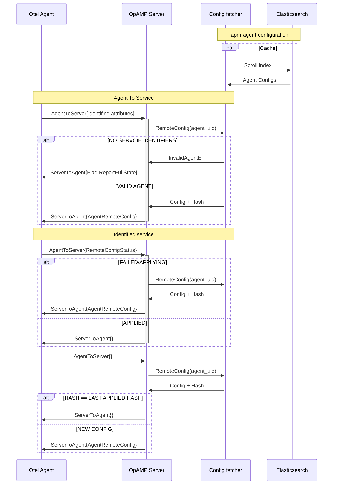

# High level architecture diagram

```mermaid
sequenceDiagram
    participant agent as Otel Agent
    participant ext as OpAMP Server
    participant db as Config fetcher
    participant es as Elasticsearch


    Note over db,es: .apm-agent-configuration
    par Cache
        db->>+es: Scroll index
        es->>+db: Agent Configs
    end


    Note over agent,db: Agent To Service
    agent->>+ext: AgentToServer{Identifing attributes}
    ext->>db: RemoteConfig(agent_uid)
    alt NO SERVCIE IDENTIFIERS
        db->>ext: InvalidAgentErr
        ext->>agent: ServerToAgent{Flag.ReportFullState}
    else VALID AGENT
        db->>ext: Config + Hash
        ext->>-agent: ServerToAgent{AgentRemoteConfig}
    end

    Note over agent,db: Identified service
    agent->>+ext: AgentToServer{RemoteConfigStatus}
    alt FAILED/APPLYING
        ext->>db: RemoteConfig(agent_uid)
        db->>ext: Config + Hash
        ext->>agent: ServerToAgent{AgentRemoteConfig}
    else APPLIED
        ext->>-agent: ServerToAgent{}
    end

    agent->>+ext: AgentToServer{}
    ext->>db: RemoteConfig(agent_uid)
    db->>ext: Config + Hash
    alt HASH == LAST APPLIED HASH
        ext->>agent: ServerToAgent{}
    else NEW CONFIG
        ext->>agent: ServerToAgent{AgentRemoteConfig}
    end
```
