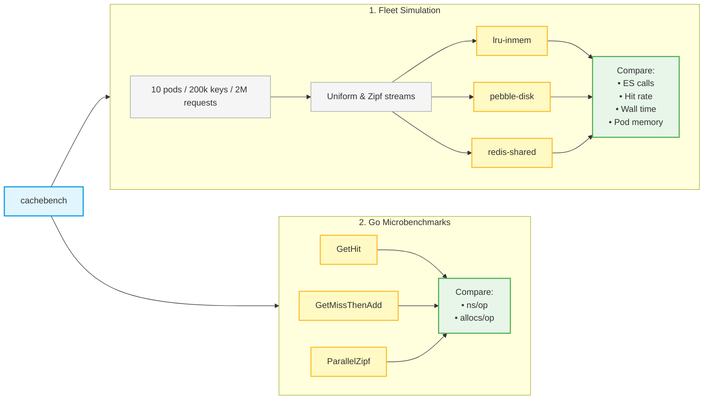

While we don't have an issue for this, I will add this comment here.

Once API keys are source-granular (one key per source), `apikeyauth` can't cache them all: the keyspace becomes the number of active sources, thousands per deployment, so the in-memory LRU thrashes and most lookups fall through to a `_has_privileges` call to Elasticsearch.

The routing caches are unaffected: `source_resolver_middleware` strips the source label before routing, so they stay keyed on the deployment and their cardinality is unchanged. (If you are lost when I mention `source_resolver_middleware`, this is just the middleware that handles the source ID proposed in https://github.com/elastic/ingest-dev/issues/8130#issuecomment-4861004948, and tested in https://github.com/elastic/hosted-otel-collector/pull/3381).


# cachebench: source-auth cache backend comparison

Benchmarks three backends for the `apikeyauthextension` source-auth cache.
Each source ID has a unique API key, so the cache must scale with active
sources while limiting Elasticsearch lookups.

Backends map to Options 0, 1, and 2 of `hosted-otel-collector/source-cache-scaling-options.md`:

| Backend | Option | Shape |
|---------|--------|-------|
| `lru-inmem` | 0 | sharded in-memory freelru, per pod |
| `pebble-disk` | 1 | small in-memory hot tier + on-disk pebble, per pod |
| `redis-shared` | 2 | small in-memory L1 + shared Redis L2, per fleet |

All backends implement the same `Cache` interface (`cache.go`) and use identical
request streams.

## How to run

Redis needs an external store. LRU and Pebble need no setup.

```bash
docker run -d --rm --name cachebench-redis -p 6379:6379 redis:7-alpine
```

Run the fleet simulation:

```bash
go test -run TestFleetSimulation -v
```

Run latency and allocation benchmarks:

```bash
go test -run='^$' -bench=. -benchmem -benchtime=1s -count=6 | tee bench.txt
benchstat bench.txt
```

Set `CACHEBENCH_REDIS_ADDR=""` to skip Redis, or set it to another Redis address.
If Redis is unreachable, Redis cases skip.

## Results



Hardware: Intel Core Ultra 7 258V, Go 1.26, Redis 7 in a local container (same
host, so L2 latency here is a lower bound; a real in-region hop is higher).

### Decision metric: Elasticsearch calls across a 10-pod fleet

2,000,000 auth requests spread across 10 pods over a 200,000-key working set.
`es_calls` is the number of misses that would hit Elasticsearch `_has_privileges`;
lower is better.

- `uniform`: every source key is equally likely.
- `zipf 1.2`: a few hot source keys get most requests.
- `cap`: local cache capacity per pod, in source-key entries.

#### Uniform, cap 8192

| Backend | ES calls | Hit % | Wall | Mem/pod |
|---------|---------:|------:|-----:|--------:|
| lru    | 1,920,196 |  3.99% |   1.83s | 520 KB |
| pebble | 1,263,733 | 36.81% |  31.80s | 520 KB + ~12 MB disk/pod |
| redis  |   199,994 | 90.00% | 153.9s | 520 KB + ~12 MB shared |

Winner by ES calls: redis, with 89.6% fewer calls than lru and 84.2% fewer than pebble.

#### Zipf 1.2, cap 8192

| Backend | ES calls | Hit % | Wall | Mem/pod |
|---------|---------:|------:|-----:|--------:|
| lru    |   234,539 | 88.27% |   0.41s | 520 KB |
| pebble |   201,870 | 89.91% |   1.36s | 520 KB + ~12 MB disk/pod |
| redis  |    85,882 | 95.71% |  24.53s | 520 KB + ~12 MB shared |

Winner by ES calls: redis, with 63.4% fewer calls than lru and 57.5% fewer than pebble.

#### Uniform, cap 65536

| Backend | ES calls | Hit % | Wall | Mem/pod |
|---------|---------:|------:|-----:|--------:|
| lru    | 1,466,354 | 26.68% |   1.13s | 4.2 MB |
| pebble | 1,263,733 | 36.81% |  17.44s | 4.2 MB + ~12 MB disk/pod |
| redis  |   199,994 | 90.00% |  98.8s | 4.2 MB + ~12 MB shared |

Winner by ES calls: redis, with 86.4% fewer calls than lru and 84.2% fewer than pebble.

### Per-operation cost (benchstat)

| Benchmark | lru | pebble | redis |
|-----------|----:|-------:|------:|
| GetHit (L1 hit) | 93 ns, 0 alloc | 139 ns, 0 alloc | 99 ns, 0 alloc |
| GetMissThenAdd | 381 ns, 2 alloc | 2.20 µs, 5 alloc | 129 µs, 38 alloc |
| ParallelZipf (steady state) | 205 ns, 2 alloc | 1.90 µs, 20 alloc | 5.27 µs, 45 alloc |

Winners:

- `GetHit`: lru is fastest, 33.1% faster than pebble and 6.1% faster than redis. All use 0 allocs.
- `GetMissThenAdd`: lru is fastest and lowest allocation, 82.7% faster than pebble and 99.7% faster than redis, with 2 allocs versus 5 and 38.
- `ParallelZipf`: lru is fastest and lowest allocation, 89.2% faster than pebble and 96.1% faster than redis, with 2 allocs versus 20 and 45.

## Interpretation and recommendation

Use Redis with an in-memory L1.

- LRU alone is fastest, but it misses too often and re-authenticates per pod.
- Pebble reduces misses versus LRU, but it still stores and authenticates per pod.
- Redis is slower per miss, but it deduplicates ES calls across the fleet.

Also add singleflight around the ES call so cold misses cannot fan out into a
`_has_privileges` storm.

## Realism notes

- The fleet shape is realistic: 10 ingest pods, 200,000 active source keys, and 2,000,000 auth requests.
- Redis latency is optimistic because Redis ran on the same host. Measure real in-region latency before using the wall-time numbers.
- The harness counts ES `_has_privileges` calls; it does not include real ES latency.
- Memory is estimated, not measured RSS.
- TTL is long so the benchmark isolates capacity and cross-pod sharing, not expiry behavior.
