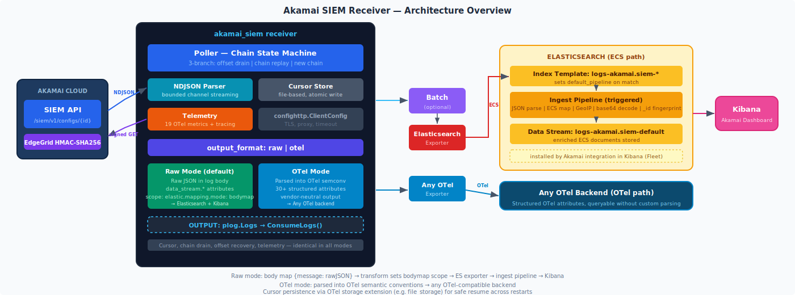
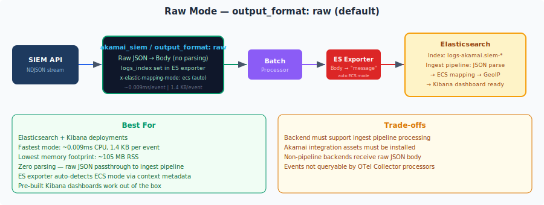
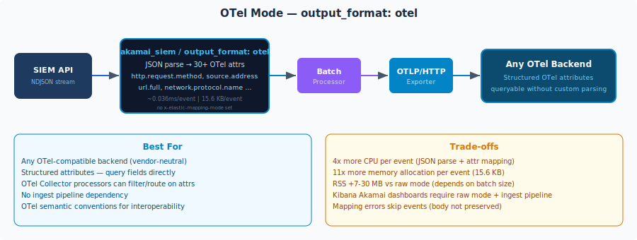
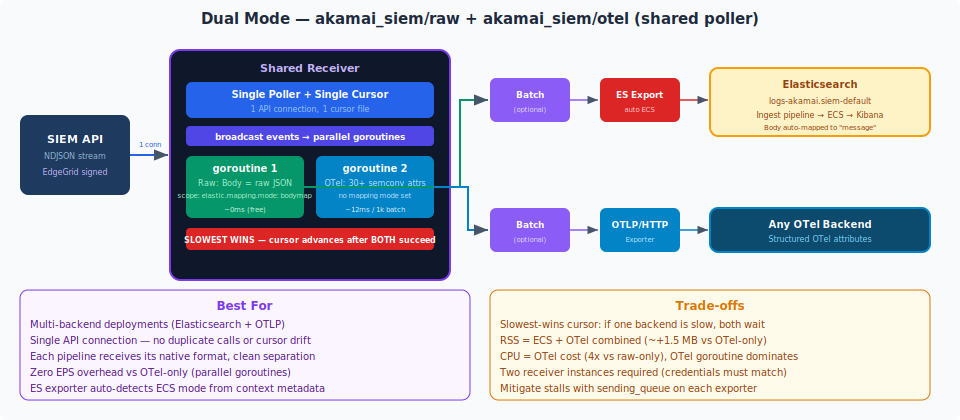

# Akamai SIEM Receiver

<!-- status autogenerated section -->
| Status        |           |
| ------------- |-----------|
| Stability     | [alpha]: logs   |
| Distributions | [] |
| Issues        | [](https://github.com/elastic/opentelemetry-collector-components/issues?q=is%3Aopen+is%3Aissue+label%3Areceiver%2Fakamaisiem) [](https://github.com/elastic/opentelemetry-collector-components/issues?q=is%3Aclosed+is%3Aissue+label%3Areceiver%2Fakamaisiem) |
| Code coverage | [](https://app.codecov.io/gh/elastic/opentelemetry-collector-components/tree/main/?components%5B0%5D=receiver_akamaisiem&displayType=list) |

[alpha]: https://github.com/open-telemetry/opentelemetry-collector/blob/main/docs/component-stability.md#alpha
<!-- end autogenerated section -->

Polls the [Akamai SIEM API](https://techdocs.akamai.com/siem-integration/reference/get-configid) for security events and emits them as OTel logs. Supports three operating modes controlled by `output_format`:

- **Raw mode** (`output_format: raw`, default): Raw Akamai JSON placed in `LogRecord.Body` as a map (`{message: rawJSON}`). Route to Elasticsearch with a `transform` processor that sets `elastic.mapping.mode: bodymap` as a scope attribute and `logs_dynamic_index: enabled: true` on the exporter (see [The `transform/raw` processor](#1-the-transformraw-processor-required-for-elasticsearch)). The existing [Akamai integration](https://docs.elastic.co/integrations/akamai) ingest pipeline handles all enrichment. Works with pre-built Kibana dashboards out of the box.
- **OTel mode** (`output_format: otel`): Receiver parses JSON and maps 30+ fields to OTel semantic conventions directly on the `LogRecord`. Works with any OTel-compatible backend.
- **Dual mode**: Two receiver instances (`akamai_siem/raw` + `akamai_siem/otel`) share a single API connection and cursor. Each pipeline gets its native format — Elasticsearch gets raw JSON, OTLP backend gets structured attributes. Zero duplicate API calls.

## Contents

- [Architecture](#architecture)
  - [Raw Mode Path](#raw-mode-path)
  - [OTel Mode Path](#otel-mode-path)
  - [Dual Mode Path](#dual-mode-path)
  - [Data Flow](#data-flow)
  - [Chain State Machine](#chain-state-machine)
  - [Streaming Architecture (per page)](#streaming-architecture-per-page)
  - [What the Receiver Does vs What It Doesn't](#what-the-receiver-does-vs-what-it-doesnt)
  - [Component naming convention](#component-naming-convention)
  - [Pipeline Processors](#pipeline-processors)
- [Getting Started](#getting-started)
  - [Scenario 1: Raw Mode → Elasticsearch + Kibana Dashboard](#scenario-1-raw-mode--elasticsearch--kibana-dashboard)
  - [Scenario 2: OTel Mode → Elasticsearch (Structured Attributes)](#scenario-2-otel-mode--elasticsearch-structured-attributes)
  - [Scenario 3: OTel Mode → OTLP Backend](#scenario-3-otel-mode--otlp-backend)
  - [Scenario 4: Dual Export — ES + OTLP (Shared Poller)](#scenario-4-dual-export--es--otlp-shared-poller)
  - [Scenario 5: Dual Export — Both to Elasticsearch (Shared Poller)](#scenario-5-dual-export--both-to-elasticsearch-shared-poller)
  - [Scenario 6: File Export (Testing / Archival)](#scenario-6-file-export-testing--archival)
  - [Scenario 7: Console Debug (Development)](#scenario-7-console-debug-development)
  - [Scenario 8: High-Throughput Production](#scenario-8-high-throughput-production)
- [Using Without Fleet (Headless Mode)](#using-without-fleet-headless-mode)
- [Live Test Results](#live-test-results)
- [Configuration Reference](#configuration-reference)
- [OTel Semantic Convention Mapping](#otel-semantic-convention-mapping)
- [Telemetry](#telemetry)
- [Performance](#performance)

## Architecture

### Overview



### Raw Mode Path



Raw mode is the default and the fastest path. The receiver places the raw Akamai JSON event string into `LogRecord.Body` as a map with key `message` — no parsing, no field extraction. A `transform` processor in the pipeline config handles all Elasticsearch-specific concerns, keeping the receiver backend-agnostic.

#### 1. The `transform/raw` processor (required for Elasticsearch)

The `transform/raw` processor does two things:

**a) Sets bodymap mapping mode** — tells the ES exporter to serialize the body map fields directly as document fields (instead of writing to `body.text`). Without this, the Akamai ingest pipeline fails because it expects a `message` field.

**b) Copies `data_stream.*` into the body map** — in bodymap mode, the ES exporter serializes **only** the body map content into the document. Resource attributes (like `data_stream.dataset`) are used for index routing but are **not** written into the document body. Kibana filters on `data_stream.dataset` inside the document, so these fields must be in the body map.

```yaml
processors:
  transform/raw:
    log_statements:
      # Set bodymap mapping mode on scope — tells the ES exporter to write
      # body map fields directly as document fields. Scope attributes are part
      # of the plog.Logs data structure and survive batch processor flushes and
      # exporter queues without any special config.
      - context: scope
        statements:
          - set(attributes["elastic.mapping.mode"], "bodymap")
      # Copy data_stream.* into the body map — bodymap mode only writes body
      # content to the document, so these must be present for Kibana filters.
      - context: log
        statements:
          - set(body["data_stream.type"], "logs")
          - set(body["data_stream.dataset"], resource.attributes["data_stream.dataset"])
          - set(body["data_stream.namespace"], "default")
```

> **Why scope attributes instead of context metadata?** The [ES exporter migration docs](https://github.com/open-telemetry/opentelemetry-collector-contrib/tree/main/exporter/elasticsearchexporter#migration-setting-mapping-mode-via-scope-attribute) recommend scope attributes as the preferred mechanism. Context metadata (`x-elastic-mapping-mode`) requires `metadata_keys` config on every buffering component to survive flushes — a brittle requirement. Scope attributes travel with the data itself.

#### Why OTel mode does not need a `transform` processor

In OTel mode, the ES exporter uses its **default `otel` serialization** which:
- Writes the full `LogRecord` (body, attributes, resource attributes, scope) into the document
- Embeds `data_stream.*` from resource attributes into the document automatically
- Appends `.otel` to `data_stream.dataset` (e.g., `akamai.siem` → `akamai.siem.otel`)

No scope attribute override is needed because `otel` is already the exporter's default. No `data_stream.*` body map injection is needed because OTel mode serializes the complete record, not just the body.

#### 2. Data stream routing

The receiver does not set `data_stream.*` attributes — routing is handled entirely in the pipeline config, keeping the receiver decoupled from Elastic-specific concerns.

Use a `resource` processor to set `data_stream.dataset`, and `logs_dynamic_index: enabled: true` on the ES exporter so the dynamic router picks it up:

```yaml
processors:
  resource:
    attributes:
      - key: data_stream.dataset
        value: "akamai.siem"
        action: upsert

exporters:
  elasticsearch:
    logs_dynamic_index:
      enabled: true
```

> **Note:** `data_stream.type` defaults to `"logs"` in the ES exporter's dynamic router (inferred from the signal type), so you do not need to set it explicitly. `data_stream.namespace` defaults to `"default"`. Only set these if you need to override the defaults.

The dynamic router reads `data_stream.dataset` and `data_stream.namespace` from resource attributes and derives the index name (`logs-akamai.siem-default`). The Elasticsearch index template `logs-akamai.siem-*` matches and sets `default_pipeline` to the Akamai ingest pipeline automatically.

Without a `resource` processor, the dynamic router defaults to `dataset="generic"` → index `logs-generic-default`.

#### What the ingest pipeline does

Once the document lands in Elasticsearch, the Akamai integration's ingest pipeline takes over:

1. `json` processor — parses the `message` field (raw Akamai JSON) into structured fields
2. Renames `message` → `event.original` (preserves the original)
3. Maps fields to ECS: `httpMessage.*` → `http.*`, `attackData.*` → custom ECS fields, `geo.*` → `source.geo.*`
4. GeoIP enrichment on `source.ip`
5. Base64 + URL decode on attack rule data
6. `fingerprint` processor — sets `_id` from event fields to deduplicate replays

Pre-built Kibana dashboards work immediately after the pipeline runs.

### OTel Mode Path



OTel mode parses each Akamai JSON event and maps 30+ fields into OTel semantic convention attributes directly on the `LogRecord`. Fields like `httpMessage.method` become `http.request.method`, `geo.country` becomes `source.geo.country_iso_code`, etc. This produces structured, queryable log records that any OTel-compatible backend can index and search natively without custom parsing.

OTel mode output is vendor-neutral — no Elastic-specific scope attributes are required. If routing to Elasticsearch, use a `transform` processor to set `elastic.mapping.mode: otel` (the exporter's default).

> **Data stream naming:** When the Elasticsearch exporter uses `otel` mapping mode (the default), it automatically appends `.otel` to the `data_stream.dataset` value. For example, if you set `data_stream.dataset: akamai.siem` via a resource processor, the actual target data stream becomes `logs-akamai.siem.otel-default`. This matches the built-in `logs-*.otel-*` index template. No manual suffix is needed.

The trade-off is compute cost: JSON parsing + 30-field attribute mapping adds ~4x more CPU per event and ~7x more memory allocation compared to raw mode. However, because the receiver is I/O-bound (gzip decompression + NDJSON streaming from the API), the actual EPS throughput is identical to raw mode.

### Dual Mode Path



Dual mode sends events to both Elasticsearch and an OTLP backend simultaneously from a **single API connection**. The Elasticsearch pipeline receives raw JSON bodies and the OTLP pipeline receives structured OTel attributes — each gets exactly the format it needs with zero cross-contamination.

#### Why two receiver instances are required

The Akamai SIEM API is a single data source, so it seems wrong to declare two receivers for one input. This is an **OTel Collector framework limitation** in how `ConsumeLogs` works:

1. Each receiver gets exactly **one** `consumer.Logs` from the factory
2. When a single receiver feeds multiple pipelines, OTel wraps them in a `fanoutconsumer` that delivers the **same** `plog.Logs` object to all pipelines
3. There is no mechanism for a receiver to send different data to different pipelines from a single `ConsumeLogs` call

This means if we used one receiver with both pipelines, both would get identical log records — either both get raw JSON body, or both get OTel attributes. Clean output segregation is impossible with a single receiver instance.

The solution: **two receiver instances, one shared poller**. Each instance gets its own `consumer.Logs`, builds its own `plog.Logs` in the correct format, and calls `ConsumeLogs` independently. The `sharedcomponent` pattern ensures both instances share a single API connection, HTTP client, cursor store, and poller underneath. From the Akamai API's perspective, there is exactly one client making requests.

#### Shared authentication

Both instances connect to the same API endpoint with the same credentials. The receiver identifies shared connections by hashing `(endpoint, config_ids, authentication)` — when this key matches across instances, they share a poller. If credentials differ (even by a typo), two independent API connections are created silently.

Since credentials must be identical, repeating them in the config can be error-prone. Use **YAML anchors** to define credentials once and reference them:

```yaml
receivers:
  akamai_siem/raw:
    endpoint: &ep "https://akab-xxxxx.luna.akamaiapis.net"
    config_ids: &cid "12345"
    authentication: &auth
      client_token: "${AKAMAI_CLIENT_TOKEN}"
      client_secret: "${AKAMAI_CLIENT_SECRET}"
      access_token: "${AKAMAI_ACCESS_TOKEN}"
    output_format: raw
    storage: file_storage

  akamai_siem/otel:
    endpoint: *ep          # references &ep above
    config_ids: *cid       # references &cid above
    authentication: *auth  # references &auth above — guaranteed identical
    output_format: otel

extensions:
  file_storage:
    directory: /var/lib/otelcol/storage

service:
  extensions: [file_storage]
  pipelines:
    logs/es:
      receivers: [akamai_siem/raw]
      exporters: [elasticsearch]
    logs/otlp:
      receivers: [akamai_siem/otel]
      exporters: [otlphttp]
```

The `&auth` anchor defines the authentication block on the first instance. The `*auth` reference on the second instance copies it exactly at YAML parse time — both resolve to identical values, guaranteeing they share a single poller.

Without anchors, environment variables (`${AKAMAI_CLIENT_TOKEN}`) on both instances also work — they resolve to the same values at runtime.

The instance names (`/raw` and `/otel`) are arbitrary labels. Only `output_format` determines the output structure.

#### Slowest-wins cursor

The shared cursor advances only after **both** pipelines successfully process a batch. If one backend is slow or down, neither pipeline advances. This is the safest strategy: zero data loss for either pipeline.

**Mitigation:** Use `sending_queue` on each exporter to absorb transient downstream issues without blocking `ConsumeLogs()`.

#### Parallel formatting

The poller broadcasts each event batch to both goroutines simultaneously:
- Goroutine 1 (Raw): copies raw JSON into `LogRecord.Body` — ~0ms, effectively free
- Goroutine 2 (OTel): parses JSON, maps 30+ attributes — ~12ms per 1000 events

Total latency = max(Raw, OTel) = OTel only. Dual mode has **zero throughput overhead** vs OTel-only mode (benchmarked: 15,769 vs 15,774 EPS).

### Data Flow

1. **Poller** executes the three-branch chain state machine (offset drain, chain replay, new chain)
2. **EdgeGrid Auth** signs each HTTP request with HMAC-SHA256 per Akamai's specification
3. **NDJSON Streaming** parses response through a bounded channel using a 1-line delay pattern:
   - Scanner goroutine reads lines, sends to bounded channel (`stream_buffer_size`)
   - Consumer batches events from channel, calls `ConsumeLogs` per batch (`batch_size`)
   - Back-pressure: when `ConsumeLogs` is slow, channel fills, scanner blocks
   - Peak memory bounded to `stream_buffer_size + batch_size` events regardless of page size
4. **Cursor Store** persists chain state only after ALL batches in a page succeed
5. **output_format** determines how events are emitted per batch:
   - **raw**: Body map `{message: rawJSON}` → `transform` processor sets `elastic.mapping.mode: bodymap` on scope → ES exporter writes `message` field → ingest pipeline enriches
   - **otel**: Parsed into semantic convention attributes (HTTP, URL, source, geo, TLS, attack data)
   - **Dual**: Both modes run in parallel on the same event batch → each pipeline gets its format
6. **Mapping mode is a pipeline concern**: The receiver does not set any mapping mode. For raw mode, the `transform/raw` processor sets `elastic.mapping.mode: bodymap` as a scope attribute and copies `data_stream.*` into the body map (bodymap mode only writes body content to the document). OTel mode needs no transform — the exporter's default `otel` serialization handles everything. See [The `transform/raw` processor](#1-the-transformraw-processor-required-for-elasticsearch) for details.
7. Cursor, chain drain, offset recovery, and telemetry are **identical in all modes**

### Chain State Machine

The receiver implements the same three-branch polling state machine as the Beats Akamai input:

```
                    +------------------+
                    | Start poll cycle  |
                    +--------+---------+
                             |
              +--------------+--------------+
              |              |              |
        [not caught up   [not caught up   [caught up
         + valid offset]  + no offset]     or first run]
              |              |              |
              v              v              v
        Branch 1:       Branch 2:       Branch 3:
        DRAIN CHAIN     REPLAY CHAIN    NEW CHAIN
        (offset-based)  (time-based     (time-based
                         with overlap)   fresh window)
              |              |              |
              +--------------+--------------+
                             |
                     +-------v--------+
                     | Fetch page     |
                     | Parse NDJSON   |
                     | Emit events    |
                     | Update cursor  |
                     +-------+--------+
                             |
                  +----------+---------+
                  |                    |
           [events < limit]    [events == limit]
                  |                    |
                  v                    v
            Chain drained        Continue to
            (caught up)          next page
```

#### Error Recovery

| Error | Recovery Action |
|---|---|
| 416 (offset expired) | Clear offset, replay chain with time window |
| 400 "invalid timestamp" | Retry up to `invalid_timestamp_retries`, then clear offset |
| 400 "from too old" | Clamp `from` to max lookback (12h), replay |
| 400 (other) | Non-recoverable, end poll cycle |
| Max recovery attempts reached | End poll cycle, log error |

### Streaming Architecture (per page)

```
API Response Body
    |
    v
[Scanner Goroutine]
    |  1-line delay: holds last line to check for offset context
    v
bounded channel (stream_buffer_size=4)
    |  back-pressure: blocks scanner when full
    v
[Batch Consumer] (on poller goroutine)
    |  accumulates batch_size=1000 events
    v
emitEvents() → ConsumeLogs()
    |  repeated until channel drained
    v
cursor persisted (only after all batches succeed)
```

### Raw Mode Path

```
Receiver → plog.Logs (body map {message: rawJSON})
  → Resource processor (adds data_stream.dataset=akamai.siem)
    → Transform processor (sets bodymap scope + copies data_stream.* into body map)
      → [Batch] (optional, recommended)
        → ES Exporter (reads scope attribute, uses bodymap mode, logs_dynamic_index: enabled: true)
          → Dynamic router: logs-akamai.siem-default
            → Index Template matches, sets default_pipeline
              → Ingest Pipeline: JSON parse, ECS map, GeoIP, base64 decode, _id fingerprint
                → Enriched documents stored in Data Stream
                  → Kibana Akamai SIEM Dashboard
```

### OTel Mode Path

```
Receiver → plog.Logs (structured OTel attributes)
  → [Batch] (optional, recommended) → Exporter
    → Elasticsearch (logs_dynamic_index → routes by data_stream.* attrs, no ingest pipeline needed)
    → OR any OTel-compatible backend
```

Note: OTel mode does not work with the existing Akamai Kibana dashboard, which expects ECS field names from the ingest pipeline. There is no `akamai_siem_otel` integration package yet.

### What the Receiver Does vs What It Doesn't

| Responsibility | Raw Mode | OTel Mode |
|---|---|---|
| Poll Akamai SIEM API | Receiver | Receiver |
| EdgeGrid authentication | Receiver | Receiver |
| NDJSON parsing + offset tracking | Receiver | Receiver |
| Chain state machine + cursor persistence | Receiver | Receiver |
| Telemetry (18 metrics) | Receiver | Receiver |
| JSON field extraction | ES ingest pipeline | Receiver (mapper) |
| ECS mapping | ES ingest pipeline | N/A |
| OTel semantic convention mapping | N/A | Receiver (mapper) |
| URL-decode + base64-decode rules | ES ingest pipeline | Receiver (mapper) |
| GeoIP enrichment | ES ingest pipeline | Not available |
| Dashboards | Akamai integration (Kibana) | Not available |
| Data stream routing | `resource` processor + ES exporter (`logs_dynamic_index`) | `resource` processor + ES exporter (`logs_dynamic_index`) |

### Component naming convention

OTel Collector configs use a `type/name` convention to create multiple instances of the same component. The `type` identifies the actual processor (or receiver, exporter, etc.), and `name` is an arbitrary label you choose:

```yaml
processors:
  transform/raw:    # type=transform, name=raw
    ...
  transform/otel:   # type=transform, name=otel (same processor, different config)
    ...
  batch/raw:        # type=batch, name=raw
    ...
  batch/otel:       # type=batch, name=otel
    ...
```

When only one instance is needed, the name can be omitted: `transform:`, `batch:`, `resource:`. The examples in this README use named instances (`transform/raw`, `batch/raw`) in dual-mode configs where both pipelines need separate processor instances, and plain names (`transform`, `batch`) in single-pipeline configs.

### Pipeline Processors

The example configs in this README use standard OTel Collector processors. These are not part of the receiver — they are general-purpose pipeline components:

- **`resource` processor** — Adds or updates resource-level attributes on every log record passing through the pipeline. Used here to set `data_stream.dataset` so the Elasticsearch exporter's dynamic router can derive the correct target index (e.g., `logs-akamai.siem-default`). `data_stream.type` defaults to `"logs"` and `data_stream.namespace` defaults to `"default"`, so only `dataset` needs to be set explicitly. Without it, documents land in `logs-generic-default`.

- **`transform` processor** (required for raw mode Elasticsearch pipelines, named `transform/raw` in dual-mode configs) — Uses [OTTL](https://github.com/open-telemetry/opentelemetry-collector-contrib/tree/main/processor/transformprocessor) statements to set `elastic.mapping.mode: bodymap` as a scope attribute and copy `data_stream.*` fields into the body map. See [The `transform/raw` processor](#1-the-transformraw-processor-required-for-elasticsearch) for a detailed explanation of why each statement is needed. Not required for OTel mode — the exporter's default `otel` serialization handles everything automatically.

- **`batch` processor** (optional, recommended) — Buffers log records and flushes them to the exporter in batches rather than one at a time. `timeout: 10s` means the batch is flushed every 10 seconds or when it reaches the default size limit (8192 records), whichever comes first. This reduces the number of bulk requests to Elasticsearch and improves throughput. The pipeline works without it — the `transform` processor sets a scope attribute (not context metadata), so no special buffering config is needed to preserve the mapping mode signal.

## Getting Started

### Scenario 1: Raw Mode → Elasticsearch + Kibana Dashboard

The default and recommended path for Elastic users. Raw JSON flows to Elasticsearch where the Akamai integration's ingest pipeline handles all enrichment. Works with the existing Kibana Akamai SIEM dashboard.

**Prerequisites:**
- Akamai SIEM API credentials (client token, client secret, access token)
- Akamai integration installed in Kibana (creates the ingest pipeline + index template)

```yaml
receivers:
  akamai_siem:
    endpoint: "https://akab-xxxxx.luna.akamaiapis.net"
    config_ids: "12345,67890"
    authentication:
      client_token: "${AKAMAI_CLIENT_TOKEN}"
      client_secret: "${AKAMAI_CLIENT_SECRET}"
      access_token: "${AKAMAI_ACCESS_TOKEN}"
    # output_format: raw  (default, can be omitted)
    storage: file_storage

processors:
  resource:
    attributes:
      - key: data_stream.dataset
        value: "akamai.siem"
        action: upsert
  transform/raw:
    log_statements:
      - context: scope
        statements:
          - set(attributes["elastic.mapping.mode"], "bodymap")
      - context: log
        statements:
          - set(body["data_stream.type"], "logs")
          - set(body["data_stream.dataset"], resource.attributes["data_stream.dataset"])
          - set(body["data_stream.namespace"], "default")
  batch:
    timeout: 10s
    send_batch_size: 1024

exporters:
  elasticsearch:
    endpoints:
      - "https://elasticsearch:9200"
    api_key: "${ES_API_KEY}"
    logs_dynamic_index:
      enabled: true
    sending_queue:
      enabled: true
      storage: file_storage  # persistent queue for at-least-once delivery

extensions:
  file_storage:
    directory: /var/lib/otelcol/storage

service:
  extensions: [file_storage]
  telemetry:
    metrics:
      address: ":8888"
  pipelines:
    logs:
      receivers: [akamai_siem]
      processors: [resource, transform/raw, batch]
      exporters: [elasticsearch]
```

### Scenario 2: OTel Mode → Elasticsearch (Structured Attributes)

OTel semantic convention attributes stored in Elasticsearch. Useful when you want structured, queryable fields without relying on the ingest pipeline.

> **Note:** The ES exporter automatically appends `.otel` to the `data_stream.dataset`. Setting `data_stream.dataset: akamai.siem` results in the target data stream `logs-akamai.siem.otel-default`.

**Prerequisites:**
- Akamai SIEM API credentials
- No Kibana integration needed (no ingest pipeline required)

```yaml
receivers:
  akamai_siem:
    endpoint: "https://akab-xxxxx.luna.akamaiapis.net"
    config_ids: "12345,67890"
    authentication:
      client_token: "${AKAMAI_CLIENT_TOKEN}"
      client_secret: "${AKAMAI_CLIENT_SECRET}"
      access_token: "${AKAMAI_ACCESS_TOKEN}"
    output_format: otel
    storage: file_storage

processors:
  resource:
    attributes:
      - key: data_stream.dataset
        value: "akamai.siem"
        action: upsert
  batch:
    timeout: 10s

exporters:
  elasticsearch:
    endpoints:
      - "https://elasticsearch:9200"
    api_key: "${ES_API_KEY}"
    logs_dynamic_index:
      enabled: true

extensions:
  file_storage:
    directory: /var/lib/otelcol/storage

service:
  extensions: [file_storage]
  pipelines:
    logs:
      receivers: [akamai_siem]
      processors: [resource, batch]
      exporters: [elasticsearch]
```

### Scenario 3: OTel Mode → OTLP Backend

Send OTel-structured events to any OTLP-compatible backend.

**Prerequisites:**
- Akamai SIEM API credentials only

```yaml
receivers:
  akamai_siem:
    endpoint: "https://akab-xxxxx.luna.akamaiapis.net"
    config_ids: "12345,67890"
    authentication:
      client_token: "${AKAMAI_CLIENT_TOKEN}"
      client_secret: "${AKAMAI_CLIENT_SECRET}"
      access_token: "${AKAMAI_ACCESS_TOKEN}"
    output_format: otel

exporters:
  otlp:
    endpoint: "otel-collector:4317"

service:
  pipelines:
    logs:
      receivers: [akamai_siem]
      exporters: [otlp]
```

### Scenario 4: Dual Export — ES + OTLP (Shared Poller)

Send events to both Elasticsearch (raw JSON for Kibana dashboards) and an OTLP backend (structured OTel attributes) simultaneously. Both receiver instances share a **single API connection and cursor** — no duplicate API calls.

```yaml
receivers:
  # Raw instance — raw JSON body for ES ingest pipeline
  akamai_siem/raw:
    endpoint: "https://akab-xxxxx.luna.akamaiapis.net"
    config_ids: "12345"
    authentication:
      client_token: "${AKAMAI_CLIENT_TOKEN}"
      client_secret: "${AKAMAI_CLIENT_SECRET}"
      access_token: "${AKAMAI_ACCESS_TOKEN}"
    output_format: raw
    storage: file_storage

  # OTel instance — structured attributes for any backend
  # Same endpoint + config_ids + auth = shared poller (single API connection)
  akamai_siem/otel:
    endpoint: "https://akab-xxxxx.luna.akamaiapis.net"
    config_ids: "12345"
    authentication:
      client_token: "${AKAMAI_CLIENT_TOKEN}"
      client_secret: "${AKAMAI_CLIENT_SECRET}"
      access_token: "${AKAMAI_ACCESS_TOKEN}"
    output_format: otel

processors:
  resource/es:
    attributes:
      - key: data_stream.dataset
        value: "akamai.siem"
        action: upsert
  transform/raw:
    log_statements:
      - context: scope
        statements:
          - set(attributes["elastic.mapping.mode"], "bodymap")
      - context: log
        statements:
          - set(body["data_stream.type"], "logs")
          - set(body["data_stream.dataset"], resource.attributes["data_stream.dataset"])
          - set(body["data_stream.namespace"], "default")
  batch/raw:
    timeout: 10s
  batch/otel:
    timeout: 10s

exporters:
  elasticsearch:
    endpoints:
      - "https://elasticsearch:9200"
    api_key: "${ES_API_KEY}"
    logs_dynamic_index:
      enabled: true
    sending_queue:
      enabled: true
      storage: file_storage
  otlphttp:
    endpoint: "https://otlp-backend:4318"
    sending_queue:
      enabled: true

extensions:
  file_storage:
    directory: /var/lib/otelcol/storage

service:
  extensions: [file_storage]
  pipelines:
    logs/es:
      receivers: [akamai_siem/raw]
      processors: [resource/es, transform/raw, batch/raw]
      exporters: [elasticsearch]
    logs/otlp:
      receivers: [akamai_siem/otel]
      processors: [batch/otel]
      exporters: [otlphttp]
```

> **Tip:** Use YAML anchors (`&auth` / `*auth`) to avoid repeating the authentication block — see [Shared authentication](#shared-authentication).

> **Note:** Both instances share the same endpoint + config_ids + auth, so they automatically share a single poller and cursor. The cursor advances only after both pipelines succeed (**slowest-wins**). Use `sending_queue` on exporters to absorb transient downstream issues without blocking the cursor.

### Scenario 5: Dual Export — Both to Elasticsearch (Shared Poller)

Send events to two Elasticsearch data streams simultaneously: raw JSON for Kibana dashboards and structured OTel attributes for direct querying. Both use the **same** `data_stream.dataset` — the ES exporter automatically appends `.otel` to the dataset when using OTel mapping mode.

```yaml
receivers:
  akamai_siem/raw:
    endpoint: "https://akab-xxxxx.luna.akamaiapis.net"
    config_ids: "12345"
    authentication: &auth
      client_token: "${AKAMAI_CLIENT_TOKEN}"
      client_secret: "${AKAMAI_CLIENT_SECRET}"
      access_token: "${AKAMAI_ACCESS_TOKEN}"
    output_format: raw
    storage: file_storage

  akamai_siem/otel:
    endpoint: "https://akab-xxxxx.luna.akamaiapis.net"
    config_ids: "12345"
    authentication: *auth
    output_format: otel

processors:
  resource:
    attributes:
      - key: data_stream.dataset
        value: "akamai.siem"
        action: upsert
  transform/raw:
    log_statements:
      - context: scope
        statements:
          - set(attributes["elastic.mapping.mode"], "bodymap")
      - context: log
        statements:
          - set(body["data_stream.type"], "logs")
          - set(body["data_stream.dataset"], resource.attributes["data_stream.dataset"])
          - set(body["data_stream.namespace"], "default")
  batch/raw:
    timeout: 10s
  batch/otel:
    timeout: 10s

exporters:
  # Raw → bodymap serialization, dataset stays "akamai.siem" → logs-akamai.siem-default
  elasticsearch/raw:
    endpoints:
      - "https://elasticsearch:9200"
    api_key: "${ES_API_KEY}"
    logs_dynamic_index:
      enabled: true

  # OTel (default) → router appends .otel → logs-akamai.siem.otel-default
  elasticsearch/otel:
    endpoints:
      - "https://elasticsearch:9200"
    api_key: "${ES_API_KEY}"
    logs_dynamic_index:
      enabled: true

extensions:
  file_storage:
    directory: /var/lib/otelcol/storage

service:
  extensions: [file_storage]
  pipelines:
    logs/raw:
      receivers: [akamai_siem/raw]
      processors: [resource, transform/raw, batch/raw]
      exporters: [elasticsearch/raw]
    logs/otel:
      receivers: [akamai_siem/otel]
      processors: [resource, batch/otel]
      exporters: [elasticsearch/otel]
```

The `resource` processor sets `data_stream.dataset: akamai.siem` for both pipelines. The data stream name diverges at the exporter:

| Exporter | Mapping mode | `.otel` suffix | Target data stream |
|---|---|---|---|
| `elasticsearch/raw` | `bodymap` (via scope attribute) | No | `logs-akamai.siem-default` |
| `elasticsearch/otel` | `otel` (default) | **Yes** (automatic) | `logs-akamai.siem.otel-default` |

### Scenario 6: File Export (Testing / Archival)

Write events to NDJSON files for offline analysis or archival.

```yaml
receivers:
  akamai_siem:
    endpoint: "https://akab-xxxxx.luna.akamaiapis.net"
    config_ids: "12345"
    authentication:
      client_token: "${AKAMAI_CLIENT_TOKEN}"
      client_secret: "${AKAMAI_CLIENT_SECRET}"
      access_token: "${AKAMAI_ACCESS_TOKEN}"
    output_format: otel
    poll_interval: 5m
    initial_lookback: 1h

exporters:
  file:
    path: "/var/log/akamai-siem-events.jsonl"

service:
  pipelines:
    logs:
      receivers: [akamai_siem]
      exporters: [file]
```

### Scenario 7: Console Debug (Development)

Print events to stdout for development and troubleshooting. No infrastructure needed.

```yaml
receivers:
  akamai_siem:
    endpoint: "https://akab-xxxxx.luna.akamaiapis.net"
    config_ids: "12345"
    authentication:
      client_token: "${AKAMAI_CLIENT_TOKEN}"
      client_secret: "${AKAMAI_CLIENT_SECRET}"
      access_token: "${AKAMAI_ACCESS_TOKEN}"
    output_format: otel    # see structured attributes in output
    poll_interval: 30s
    initial_lookback: 1h
    event_limit: 100

exporters:
  debug:
    verbosity: detailed

service:
  pipelines:
    logs:
      receivers: [akamai_siem]
      exporters: [debug]
```

### Scenario 8: High-Throughput Production

Tuned for maximum throughput with large batch sizes and persistent queuing.

```yaml
receivers:
  akamai_siem:
    endpoint: "https://akab-xxxxx.luna.akamaiapis.net"
    config_ids: "12345,67890,11111"
    authentication:
      client_token: "${AKAMAI_CLIENT_TOKEN}"
      client_secret: "${AKAMAI_CLIENT_SECRET}"
      access_token: "${AKAMAI_ACCESS_TOKEN}"
    poll_interval: 10s
    event_limit: 100000
    batch_size: 5000
    stream_buffer_size: 16
    offset_ttl: 60s
    storage: file_storage
    http:
      timeout: 120s

processors:
  resource:
    attributes:
      - key: data_stream.dataset
        value: "akamai.siem"
        action: upsert
  transform/raw:
    log_statements:
      - context: scope
        statements:
          - set(attributes["elastic.mapping.mode"], "bodymap")
      - context: log
        statements:
          - set(body["data_stream.type"], "logs")
          - set(body["data_stream.dataset"], resource.attributes["data_stream.dataset"])
          - set(body["data_stream.namespace"], "default")
  batch:
    timeout: 5s
    send_batch_size: 5000
    send_batch_max_size: 10000

exporters:
  elasticsearch:
    endpoints:
      - "https://es-node1:9200"
      - "https://es-node2:9200"
      - "https://es-node3:9200"
    api_key: "${ES_API_KEY}"
    logs_dynamic_index:
      enabled: true
    sending_queue:
      enabled: true
      num_consumers: 10
      queue_size: 10000
      storage: file_storage
    retry:
      enabled: true
      max_elapsed_time: 300s

extensions:
  file_storage:
    directory: /var/lib/otelcol/storage

service:
  extensions: [file_storage]
  telemetry:
    metrics:
      address: ":8888"
  pipelines:
    logs:
      receivers: [akamai_siem]
      processors: [resource, transform/raw, batch]
      exporters: [elasticsearch]
```

## Using Without Fleet (Headless Mode)

You can use this receiver without Kibana Fleet or an agent policy. This is the typical setup when running the OTel Collector directly — for example, in a containerized environment, on a VM, or locally for testing.

The only requirement for raw mode is that the Akamai integration assets (index template + ingest pipeline) are installed in Elasticsearch. There are two ways to do this.

### Option 1: Install assets via Fleet API (no agent policy)

Fleet can install integration assets without attaching them to a policy. Send a single POST to the Fleet package API:

```bash
curl -s -u elastic:changeme \
  -X POST "https://localhost:5601/api/fleet/epm/packages/akamai/2.33.2" \
  -H "kbn-xsrf: true" \
  -H "Content-Type: application/json" \
  -d '{}' | jq .result
```

This installs the index template `logs-akamai.siem-*` and the ingest pipeline without creating any agent policy.

Check the available version first:

```bash
curl -s -u elastic:changeme \
  "https://localhost:5601/api/fleet/epm/packages/akamai" | jq .item.version
```

### Option 2: Install from Kibana UI

Go to **Kibana → Integrations → Akamai → Add Akamai SIEM** and complete the wizard. You can use a dummy agent policy — the integration assets are installed regardless.

### Production: Elasticsearch via HTTPS + API Key

```yaml
exporters:
  elasticsearch:
    endpoints:
      - "https://your-cluster.es.io:9200"
    api_key: "${ES_API_KEY}"   # base64-encoded id:api_key
    logs_dynamic_index:
      enabled: true
    sending_queue:
      enabled: true
      storage: file_storage
    retry:
      enabled: true
      max_elapsed_time: 300s
```

To create an API key scoped to this index:

```bash
curl -s -u elastic:changeme \
  -X POST "https://localhost:9200/_security/api_key" \
  -H "Content-Type: application/json" \
  -d '{
    "name": "akamai-siem-receiver",
    "role_descriptors": {
      "akamai_writer": {
        "cluster": ["monitor"],
        "index": [{
          "names": ["logs-akamai.*"],
          "privileges": ["create_index", "create", "auto_configure"]
        }]
      }
    }
  }' | jq -r '"\(.id):\(.api_key)" | @base64'
```

### Local Testing: Docker Elasticsearch

Run Elasticsearch locally to test the receiver end-to-end:

```bash
# Start Elasticsearch (single-node, password auth)
docker run -d --name es-local \
  -e "discovery.type=single-node" \
  -e "ELASTIC_PASSWORD=changeme" \
  -e "xpack.security.enabled=true" \
  -p 9200:9200 \
  docker.elastic.co/elasticsearch/elasticsearch:8.17.0

# Wait for it to be ready
until curl -s -u elastic:changeme https://localhost:9200/_cluster/health \
  --cacert /tmp/es-certs/ca.crt | jq -e '.status != "red"' > /dev/null; do
  sleep 2
done
```

Minimal test config (`akamai-test.yaml`):

```yaml
receivers:
  akamai_siem:
    endpoint: "https://akab-xxxxx.luna.akamaiapis.net"
    config_ids: "12345"
    authentication:
      client_token: "${AKAMAI_CLIENT_TOKEN}"
      client_secret: "${AKAMAI_CLIENT_SECRET}"
      access_token: "${AKAMAI_ACCESS_TOKEN}"
    output_format: raw
    poll_interval: 1m
    initial_lookback: 1h
    event_limit: 1000

processors:
  resource:
    attributes:
      - key: data_stream.dataset
        value: "akamai.siem"
        action: upsert
  transform/raw:
    log_statements:
      - context: scope
        statements:
          - set(attributes["elastic.mapping.mode"], "bodymap")
      - context: log
        statements:
          - set(body["data_stream.type"], "logs")
          - set(body["data_stream.dataset"], resource.attributes["data_stream.dataset"])
          - set(body["data_stream.namespace"], "default")

exporters:
  elasticsearch:
    endpoints: ["https://localhost:9200"]
    user: "elastic"
    password: "changeme"
    tls:
      insecure_skip_verify: true
    logs_dynamic_index:
      enabled: true
  debug:
    verbosity: detailed

service:
  telemetry:
    logs:
      level: debug
    metrics:
      level: none
  pipelines:
    logs:
      receivers: [akamai_siem]
      processors: [resource, transform/raw]
      exporters: [elasticsearch, debug]
```

Run the collector:

```bash
./otelcol --config akamai-test.yaml
```

Verify events are arriving:

```bash
curl -s -u elastic:changeme \
  "https://localhost:9200/logs-akamai.siem-default/_count" \
  --insecure | jq .count
```

### Checking Index and Pipeline Health

```bash
# Check index template was installed
curl -s -u elastic:changeme \
  "https://localhost:9200/_index_template/logs-akamai.siem" --insecure | jq .

# Check ingest pipeline
curl -s -u elastic:changeme \
  "https://localhost:9200/_ingest/pipeline/logs-akamai.siem-*" --insecure | jq keys

# Check data stream stats
curl -s -u elastic:changeme \
  "https://localhost:9200/_data_stream/logs-akamai.siem-default/_stats" --insecure | jq .
```

## Live Test Results

The following documents were captured from a live run against the Akamai SIT environment with a local Elasticsearch 9.3.1 stack.

### Raw Mode — Elasticsearch document after ingest pipeline

Data stream: `logs-akamai.siem-default`
Config: `output_format: raw`, `transform/raw` processor sets `elastic.mapping.mode: bodymap` as a scope attribute and copies `data_stream.*` fields into the body map, `resource` processor sets `data_stream.dataset: akamai.siem`, `logs_dynamic_index: enabled: true`

The `transform/raw` processor sets `elastic.mapping.mode: bodymap` as a scope attribute, which tells the ES exporter to use bodymap serialization (`LogRecord.Body` map → document fields), and copies `data_stream.*` into the body map so Kibana filters work correctly. The Akamai ingest pipeline then parses the raw JSON into full ECS fields:

```json
{
  "_index": ".ds-logs-akamai.siem-default-2026.03.29-000001",
  "_id": "1774777751-zW7QLk7MmGNbuha8XEVw2iitcJc=",
  "_source": {
    "@timestamp": "2026-03-29T09:49:11.000Z",
    "ecs": { "version": "8.11.0" },
    "event": {
      "category": ["network"],
      "id": "4f9ec66f85e9a0a8",
      "kind": "event",
      "start": "2026-03-29T09:49:11.000Z"
    },
    "http": {
      "request": { "id": "4f9ec66f85e9a0a8", "method": "DELETE" },
      "response": { "bytes": 39878, "status_code": 223 },
      "version": "2.0"
    },
    "network": { "protocol": "http", "transport": "tcp" },
    "observer": { "type": "proxy", "vendor": "akamai" },
    "source": {
      "address": "207.220.32.43",
      "as": { "number": 16148 },
      "geo": { "city_name": "San Francisco", "country_iso_code": "US", "region_iso_code": "-CA" },
      "ip": "207.220.32.43"
    },
    "client": {
      "address": "207.220.32.43",
      "ip": "207.220.32.43",
      "geo": { "city_name": "San Francisco", "country_iso_code": "US" }
    },
    "url": {
      "domain": "example66.com",
      "full": "example66.com/api/v5/resource?id=2752",
      "path": "/api/v5/resource",
      "port": 80,
      "query": "id=2752"
    },
    "akamai": {
      "siem": {
        "config_id": "1",
        "policy_id": "policy_8",
        "rule_actions": ["deny", "alert"],
        "rule_tags": ["owasp", "sql"],
        "rules": [
          { "rules": "950089", "ruleMessages": "Command Injection attempt detected", "ruleActions": "deny" },
          { "rules": "950062", "ruleMessages": "SQL Injection attempt detected",     "ruleActions": "deny" }
        ]
      }
    }
  }
}
```

The `_id` (`1774777751-zW7QLk7MmGNbuha8XEVw2iitcJc=`) is set by the ingest pipeline's fingerprint processor for event deduplication. The Kibana Akamai SIEM dashboard works immediately.

### OTel Mode — Elasticsearch document

Data stream: `logs-akamai.siem.otel-default` (matches the built-in `logs-*.otel-*` index template)
Config: `output_format: otel`, `logs_dynamic_index: enabled: true`

The receiver maps Akamai fields to OTel semantic convention attributes. The raw JSON is also preserved in `body.text`:

```json
{
  "_index": ".ds-logs-akamai.siem.otel-default-2026.03.29-000001",
  "_source": {
    "@timestamp": "2026-03-29T09:51:21.000Z",
    "attributes": {
      "http.request.method": "PUT",
      "http.request.id": "750367d96679f861",
      "http.response.status_code": 386,
      "http.response.body.size": 21423,
      "url.domain": "example57.com",
      "url.full": "example57.com/api/v4/resource?id=2569",
      "url.path": "/api/v4/resource",
      "url.query": "id=2569",
      "server.port": 80,
      "network.protocol.name": "http",
      "network.protocol.version": "2.0",
      "network.transport": "tcp",
      "source.ip": "61.150.134.38",
      "source.address": "61.150.134.38",
      "source.as.number": 15605,
      "source.geo.city_name": "San Francisco",
      "source.geo.country_iso_code": "US",
      "source.geo.region_iso_code": "US-CA",
      "source.geo.continent_code": "NA",
      "related.ip": ["61.150.134.38"],
      "event.id": "750367d96679f861",
      "event.kind": "event",
      "event.category": "network",
      "observer.type": "proxy",
      "observer.vendor": "akamai",
      "akamai.siem.config_id": "1",
      "akamai.siem.policy_id": "policy_9",
      "akamai.siem.applied_action": "alert",
      "akamai.siem.rules": ["950051"],
      "akamai.siem.rule_messages": ["Remote File Inclusion attempt detected"],
      "akamai.siem.rule_tags": ["ATTACK"],
      "akamai.siem.rule_actions": ["alert"]
    },
    "body": {
      "text": "{\"attackData\":{...},\"httpMessage\":{...},\"geo\":{...}}"
    }
  }
}
```

All fields are directly queryable. No ingest pipeline needed.

### Dual Mode — shared connection confirmed

Startup log line confirming the two instances share a single API connection:

```
info  akamaisiemreceiver  dual mode active — sharing API connection with paired instance
      {"otelcol.component.id": "akamai_siem/otel", "output_format": "otel", "endpoint": "https://..."}
info  akamaisiemreceiver  akamai SIEM receiver started
      {"otelcol.component.id": "akamai_siem/raw", "mode": "dual", "event_limit": 500, ...}
```

Both data streams receive the same events simultaneously from one API poll:

| Data stream | Documents | Format |
|---|---|---|
| `logs-akamai.siem-default` | ECS-enriched, Kibana-ready | `source.ip`, `http.*`, `akamai.siem.*`, fingerprint `_id` |
| `logs-akamai.siem.otel-default` | OTel attributes | `attributes.source.ip`, `attributes.http.request.method`, `body.text` |

## Configuration Reference

| Parameter | Type | Default | Description |
|---|---|---|---|
| `endpoint` | string | (required) | Akamai API host URL |
| `config_ids` | string | (required) | Comma or semicolon-separated security configuration IDs |
| `authentication.client_token` | string | (required) | EdgeGrid client token |
| `authentication.client_secret` | string | (required) | EdgeGrid client secret |
| `authentication.access_token` | string | (required) | EdgeGrid access token |
| `output_format` | string | `raw` | Output structure: `"raw"` (raw JSON in body) or `"otel"` (OTel semantic conventions) |
| `poll_interval` | duration | `1m` | Time between polling cycles |
| `initial_lookback` | duration | `12h` | Lookback window for first poll (max 12h, Akamai limit) |
| `event_limit` | int | `10000` | Max events per API request (max 600000) |
| `offset_ttl` | duration | `120s` | Max age of stored offset before proactive replay (0 disables) |
| `max_recovery_attempts` | int | `3` | Max consecutive recovery actions per poll cycle (0 disables) |
| `invalid_timestamp_retries` | int | `2` | Immediate retries for 400 "invalid timestamp" errors |
| `batch_size` | int | `1000` | Events per ConsumeLogs call. Controls memory per batch. |
| `stream_buffer_size` | int | `4` | Bounded channel capacity between NDJSON scanner and batch consumer. Controls back-pressure. |
| `http.timeout` | duration | `60s` | HTTP request timeout (from nested `confighttp.ClientConfig`) |
| `storage` | component.ID | (nil) | Storage extension for cursor persistence (e.g., `file_storage`) |

The receiver also embeds [`confighttp.ClientConfig`](https://github.com/open-telemetry/opentelemetry-collector/blob/main/config/confighttp/README.md) for TLS, proxy, and advanced HTTP settings.

Data stream routing is decoupled from the receiver. Use a `resource` processor in the pipeline to set `data_stream.dataset`, and `logs_dynamic_index: enabled: true` on the ES exporter so the dynamic router picks it up — see [Data stream routing](#2-data-stream-routing) for details.

## OTel Semantic Convention Mapping

In `output_format: otel` mode, the receiver maps Akamai SIEM JSON fields to OTel log record attributes. All leaf fields in the raw API are strings — type conversions (→ int, → timestamp) happen during mapping. Empty strings are not mapped.

### httpMessage (always present)

| Akamai JSON Field | OTel Attribute | Type | Transform |
|---|---|---|---|
| `httpMessage.start` | Log record timestamp | timestamp | `ParseFloat` → `time.Unix(sec, nsec)` — supports integer and float strings |
| `httpMessage.method` | `http.request.method` | string | direct |
| `httpMessage.status` | `http.response.status_code` | int64 | `ParseInt` |
| `httpMessage.bytes` | `http.response.body.size` | int64 | `ParseInt` |
| `httpMessage.host` | `url.domain` | string | direct |
| `httpMessage.path` | `url.path` | string | URL-decode |
| `httpMessage.query` | `url.query` | string | URL-decode |
| `httpMessage.port` | `server.port` | int64 | `ParseInt` |
| `httpMessage.protocol` | `network.protocol.name` | string | split on `/`, lowercase first part (e.g., `"HTTP/1.1"` → `"http"`) |
| `httpMessage.protocol` | `network.protocol.version` | string | split on `/`, second part (e.g., `"HTTP/1.1"` → `"1.1"`) |
| `httpMessage.protocol` | `network.transport` | string | `"tcp"` if protocol starts with `http` |
| `httpMessage.tls` | `tls.protocol.name` | string | `"tls"` if present |
| `httpMessage.tls` | `tls.protocol.version` | string | strip `tls`/`tlsv` prefix (e.g., `"tls1.3"` → `"1.3"`) |
| `httpMessage.requestId` | `event.id` | string | direct |
| `httpMessage.requestId` | `http.request.id` | string | direct (same value, two attributes) |
| `httpMessage.host` + `path` + `query` | `url.full` | string | concatenated: `host` + `path` + `?` + `query` |

### attackData (optional)

| Akamai JSON Field | OTel Attribute | Type | Transform |
|---|---|---|---|
| `attackData.clientIP` | `source.address` | string | direct |
| `attackData.clientIP` | `source.ip` | string | direct |
| `attackData.clientIP` | `related.ip` | string[] | wrapped in slice for correlation |
| `attackData.configId` | `akamai.siem.config_id` | string | direct |
| `attackData.policyId` | `akamai.siem.policy_id` | string | direct |
| `attackData.appliedAction` | `akamai.siem.applied_action` | string | direct (also sets log severity — see below) |
| `attackData.clientReputation` | `akamai.siem.client_reputation` | string | direct |
| `attackData.slowPostAction` | `akamai.siem.slow_post_action` | string | direct |
| `attackData.slowPostRate` | `akamai.siem.slow_post_rate` | int64 | `ParseInt` |
| `attackData.rules` | `akamai.siem.rules` | string[] | URL-decode → split `;` → base64-decode |
| `attackData.ruleActions` | `akamai.siem.rule_actions` | string[] | URL-decode → split `;` → base64-decode |
| `attackData.ruleData` | `akamai.siem.rule_data` | string[] | URL-decode → split `;` → base64-decode |
| `attackData.ruleMessages` | `akamai.siem.rule_messages` | string[] | URL-decode → split `;` → base64-decode |
| `attackData.ruleTags` | `akamai.siem.rule_tags` | string[] | URL-decode → split `;` → base64-decode |
| `attackData.ruleSelectors` | `akamai.siem.rule_selectors` | string[] | URL-decode → split `;` → base64-decode |
| `attackData.ruleVersions` | `akamai.siem.rule_versions` | string[] | URL-decode → split `;` → base64-decode |

**Severity mapping** from `attackData.appliedAction`:

| Action | Severity Number | Severity Text |
|---|---|---|
| `deny`, `abort` | ERROR | `"ERROR"` |
| `tarpit`, `slow` | WARN | `"WARN"` |
| `monitor`, `alert` | INFO | `"INFO"` |
| (absent) | INFO | `"INFO"` |

### geo (optional)

| Akamai JSON Field | OTel Attribute | Type | Transform |
|---|---|---|---|
| `geo.country` | `source.geo.country_iso_code` | string | direct (2-letter ISO code) |
| `geo.city` | `source.geo.city_name` | string | direct |
| `geo.continent` | `source.geo.continent_code` | string | direct (2-letter code: NA, EU, SA, etc.) |
| `geo.country` + `geo.regionCode` | `source.geo.region_iso_code` | string | `country + "-" + regionCode` (e.g., `"BR-SP"`) |
| `geo.asn` | `source.as.number` | int64 | `ParseInt` |

### botData (optional)

| Akamai JSON Field | OTel Attribute | Type | Transform |
|---|---|---|---|
| `botData.botScore` | `akamai.siem.bot.score` | int64 | `ParseInt` (0-100) |
| `botData.responseSegment` | `akamai.siem.bot.response_segment` | int64 | `ParseInt` |

### clientData (optional)

| Akamai JSON Field | OTel Attribute | Type | Transform |
|---|---|---|---|
| `clientData.appBundleId` | `akamai.siem.client_data.app_bundle_id` | string | direct |
| `clientData.appVersion` | `akamai.siem.client_data.app_version` | string | direct |
| `clientData.sdkVersion` | `akamai.siem.client_data.sdk_version` | string | direct |
| `clientData.telemetryType` | `akamai.siem.client_data.telemetry_type` | int64 | `ParseInt` |

### userRiskData (optional)

| Akamai JSON Field | OTel Attribute | Type | Transform |
|---|---|---|---|
| `userRiskData.uuid` | `akamai.siem.user_risk.uuid` | string | direct |
| `userRiskData.status` | `akamai.siem.user_risk.status` | int64 | `ParseInt` (0 = success) |
| `userRiskData.score` | `akamai.siem.user_risk.score` | int64 | `ParseInt` (0-100) |
| `userRiskData.allow` | `akamai.siem.user_risk.allow` | int64 | `ParseInt` (0 or 1) |
| `userRiskData.risk` | `akamai.siem.user_risk.risk` | string | direct (pipe-delimited key:value pairs) |
| `userRiskData.trust` | `akamai.siem.user_risk.trust` | string | direct (pipe-delimited key:value pairs) |
| `userRiskData.general` | `akamai.siem.user_risk.general` | string | direct (pipe-delimited key:value pairs) |

### identity (optional)

| Akamai JSON Field | OTel Attribute | Type | Transform |
|---|---|---|---|
| `identity.ja4` | `akamai.siem.identity.ja4` | string | direct (JA4 TLS fingerprint) |
| `identity.tlsFingerprintV2` | `akamai.siem.identity.tls_fingerprint_v2` | string | direct |
| `identity.tlsFingerprintV3` | `akamai.siem.identity.tls_fingerprint_v3` | string | direct |

### Static attributes (always set)

| OTel Attribute | Value |
|---|---|
| `observer.vendor` | `"akamai"` |
| `observer.type` | `"proxy"` |
| `event.kind` | `"event"` |
| `event.category` | `"network"` |

### Log record fields

| Field | Source |
|---|---|
| `LogRecord.Body` | Raw JSON string (preserved for debugging/reprocessing) |
| `LogRecord.Timestamp` | Parsed from `httpMessage.start` |
| `LogRecord.SeverityNumber` | Mapped from `attackData.appliedAction` (default: INFO) |
| `LogRecord.SeverityText` | Mapped from `attackData.appliedAction` (default: `"INFO"`) |

### Fields not mapped (handled by ingest pipeline in raw mode)

| Akamai JSON Field | Reason |
|---|---|
| `httpMessage.requestHeaders` | Parsed into KV pairs by ES ingest pipeline |
| `httpMessage.responseHeaders` | Parsed into KV pairs by ES ingest pipeline; `"{p}"` = absent |
| `type`, `version`, `format` | Root-level API metadata, not event content |

## Telemetry

The receiver exposes the following OTel metrics via the collector's telemetry endpoint:

| Metric | Type | Description |
|---|---|---|
| `otelcol_akamai_siem.requests` | counter | Total API requests made |
| `otelcol_akamai_siem.request_errors` | counter | Total failed API requests |
| `otelcol_akamai_siem.events_received` | counter | Total events received from API |
| `otelcol_akamai_siem.events_emitted` | counter | Total events emitted to pipeline |
| `otelcol_akamai_siem.offset_expired` | counter | Total 416 offset out of range errors |
| `otelcol_akamai_siem.offset_ttl_drops` | counter | Total proactive offset TTL expirations |
| `otelcol_akamai_siem.recovery_attempts` | counter | Total recovery actions taken |
| `otelcol_akamai_siem.invalid_timestamp_retries` | counter | Total HMAC timestamp retries |
| `otelcol_akamai_siem.mapping_errors` | counter | Total events that failed OTel mapping (otel mode only) |
| `otelcol_akamai_siem.pages_processed` | counter | Total API response pages processed |
| `otelcol_akamai_siem.cursor_persists` | counter | Total successful cursor persist operations |
| `otelcol_akamai_siem.bytes_received` | counter | Total bytes received from the Akamai SIEM API |
| `otelcol_akamai_siem.request_duration` | histogram | API roundtrip latency (seconds) |
| `otelcol_akamai_siem.poll_duration` | histogram | Full poll iteration duration (seconds) |
| `otelcol_akamai_siem.events_per_second` | histogram | Events per second throughput per poll cycle |
| `otelcol_akamai_siem.page_processing_time` | histogram | Per-page processing time: NDJSON parse + mapping + ConsumeLogs (seconds) |
| `otelcol_akamai_siem.mapping_duration` | histogram | Time spent mapping events to output format (seconds) |
| `otelcol_akamai_siem.events_per_page` | histogram | Events received per API response page |

```yaml
service:
  telemetry:
    metrics:
      address: ":8888"
```

## Performance

Benchmarked against a live Akamai SIEM API endpoint with 100,000 events per page, nop exporter (measures receiver-only throughput). Apple M1 Max, 32 GB RAM, Go 1.24.7.

### Throughput by Mode

| Metric | Raw Mode | OTel Mode | Dual Mode |
|---|---|---|---|
| **EPS** | ~15,600 | ~15,700 | ~15,700 |
| CPU/event | 0.009ms | 0.037ms | 0.038ms |
| RSS | 105 MB | 111 MB | 113 MB |
| Alloc/event | 1.3 KB | ~10 KB | ~10 KB |
| CPU utilization | 12.8% | 50.8% | 51.8% |
| Goroutines | 12 | 12 | 11 |

EPS is flat across all modes — the receiver is I/O-bound (gzip decompression + NDJSON streaming). Dual mode has zero overhead vs OTel-only; the raw goroutine completes in ~0ms.

### Key Observations

- **Batch size (500-5000) does not affect EPS.** RSS increases only at batch_size=5000 (+10 MB raw, +30 MB OTel).
- **Buffer size (1-8) does not affect EPS or RSS.** Default of 4 is optimal.
- **Peak memory is bounded by `batch_size`, not page size.** A 600k-event page is processed as 600 batches of 1,000 — memory stays constant.
- **Raw mode** is a string copy — effectively zero CPU per event.
- **OTel mode** parses JSON and maps 30+ semantic convention attributes per event. The 4x CPU overhead is masked by I/O.

### Running Benchmarks

```bash
cd receiver/akamaisiemreceiver
go test -bench=BenchmarkEmitEvents -benchtime=1s -run='^$' .
```

Full benchmark data with pprof profiles: [BENCHMARKS.md](./BENCHMARKS.md)
