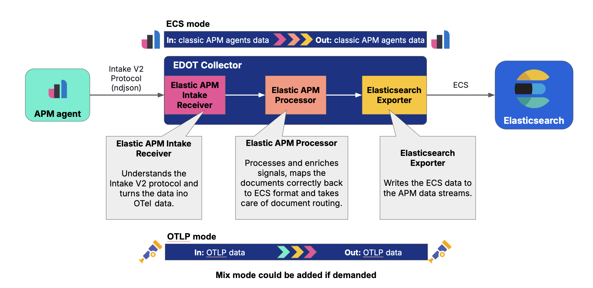

# Elasticapmintake receiver

<!-- status autogenerated section -->
| Status        |           |
| ------------- |-----------|
| Stability     | [alpha]: metrics, logs, traces   |
| Distributions | [] |
| Issues        | [](https://github.com/elastic/opentelemetry-collector-components/issues?q=is%3Aopen+is%3Aissue+label%3Areceiver%2Felasticapmintake) [](https://github.com/elastic/opentelemetry-collector-components/issues?q=is%3Aclosed+is%3Aissue+label%3Areceiver%2Felasticapmintake) |
| Code coverage | [](https://app.codecov.io/gh/elastic/opentelemetry-collector-components/tree/main/?components%5B0%5D=receiver_elasticapmintake&displayType=list) |

[alpha]: https://github.com/open-telemetry/opentelemetry-collector/blob/main/docs/component-stability.md#alpha
<!-- end autogenerated section -->

Receives data via HTTP using [APM IntakeV2 format](https://www.elastic.co/docs/solutions/observability/apm/elastic-apm-events-intake-api).

The main purpose of this receiver is to enable classic Elastic APM Agents to send data to an OTel collector. This way users can gradually switch to OTel without needing to potentially replace lots of APM Agents which may be also used with some manually instrumented code.

The receiver currently supports the [Intake v2 protocol](https://github.com/elastic/apm-data/tree/main/input/elasticapm/docs/spec/v2). RUM intake, and older intake protocols, are not supported.

## Getting started

All that is required to enable the elasticapmintake receiver is to include it in the receiver definitions:

```
receivers:
  elasticapmintake:
    agent_config:
      enabled: false
```

## Advanced configuration

The elasticapmintake receiver embeds the [confighttp.ServerConfig](https://github.com/open-telemetry/opentelemetry-collector/blob/main/config/confighttp/README.md), which means it supports standard HTTP server configuration, including TLS/mTLS and authentication.

### TLS and mTLS settings

You can enable TLS or mutual TLS to encrypt data in transit between Elastic APM agents and the receiver.

Example configuration:

```yaml
receivers:
  elasticapmintake:
    tls:
      cert_file: server.crt
      key_file: server.key
    agent_config:
      enabled: false
```

Agent environment variables:

```
ELASTIC_APM_SERVER_URL=https://localhost:8200
ELASTIC_APM_SERVER_CERT=server.crt
```

📚 OpenTelemetry TLS server configuration:
https://github.com/open-telemetry/opentelemetry-collector/blob/main/config/configtls/README.md#server-configuration

🔐 Elastic APM agent TLS configuration:
https://www.elastic.co/docs/solutions/observability/apm/apm-agent-tls-communication#apm-agent-self-sign-3

### Authentication settings

In addition to TLS, you can configure authentication to ensure that only authorized agents can send data to the receiver.

The elasticapmintake receiver supports any [configauth authenticator](https://github.com/open-telemetry/opentelemetry-collector/blob/main/config/configauth/README.md). We recommend using the [apikeyauth extension](https://github.com/elastic/opentelemetry-collector-components/tree/main/extension/apikeyauthextension) to validate Elastic APM API keys:

```yaml
extensions:
  apikeyauth:
    endpoint: "<YOUR_ELASTICSEARCH_ENDPOINT>"
    application_privileges:
      - application: "apm"
        privileges:
          - "event:write"
        resources:
          - "-"
receivers:
  elasticapmintake:
    auth:
      authenticator: apikeyauth
    tls:
      cert_file: server.crt
      key_file: server.key
    agent_config:
      enabled: false
```

Agent environment variables:

```
ELASTIC_APM_API_KEY=<YOUR_ENCODED_API_KEY>
ELASTIC_APM_SERVER_URL=https://localhost:8200
ELASTIC_APM_SERVER_CERT=server.crt
```

### Architecture



To have the full APM experience, including the curated APM UI in Kibana, the `elasticapmintake` receiver is intended to be used with some other Elastic specific components. The `elasticapmintake` takes care of receiving the NDJSON data sent by Elastic APM Agents and turning that into OTel native data, like `ptrace.Span`, `plog.LogRecord`, `pmetric.*`, and so on.

The output of this component is the OTel native translation of the Elastic APM data.

Because there is no clear 1:1 mapping between the OTel and the Elastic APM data model, there are three types of fields that go in the output OTel data. Everything that can be mapped to OTel, must be mapped into the OTel field defined by the OTel specs:

- All fields that are defined as top level fields in OTel are populated according to the OTel spec. Examples are `ParentSpanID`, `TraceID`, `StartTimestamp`, `EndTimestamp`.
- All Elastic APM Fields that can be mapped into a SemConv field, are mapped into SemConv fields. This hold true for both resource attributes and event specific attributes. For example, the [`service.name` field from the metadata](https://github.com/elastic/apm-data/blob/main/input/elasticapm/docs/spec/v2/metadata.json#L132) is stored on each event in the `service.name` SemConv attribute, while the [`node.name` field from the metadata](https://github.com/elastic/apm-data/blob/main/input/elasticapm/docs/spec/v2/metadata.json#L335) is stored on each event in the `service.instance.id`, and the `db.type` field from the Elastic APM span is stored in the `db.system` SemConv attribute.

- All fields required by Elastic APM, including Kibana, but are not part of any OTel spec, are stored in a custom attribute, using the Elastic APM field name as the key. Examples: the `transaction.name` of an Elastic APM transaction, which does not have an OTel equivalent, is stored in the `transaction.name` attribute. The `http.request.body` from the incoming Elastic APM data is stored in the `http.request.body` attribute.


The next component needed is the `elasticapm` processor, which takes care of enriching the data with some fields which is required by Kibana to visualize the data on the APM UI. This processor adds fields that are not part of OTel, but are required by Kibana.

And then finally the `elasticsearch` exporter stores the data in Elasticsearch.

Currently, the whole pipeline will automatically store data in classic APM data streams. This is different from a fully OTel native pipeline with the OTLP receiver (as opposed to the `elasticapmintake` receiver), which by default stores data in [the OTel native data streams](https://github.com/elastic/opentelemetry-dev/blob/main/docs/design-decisions/ingest/routing.md). We still have the option to extend the components described above and add a config to potentially store data from classic Elastic APM Agents in OTel native data streams in a later iteration.
